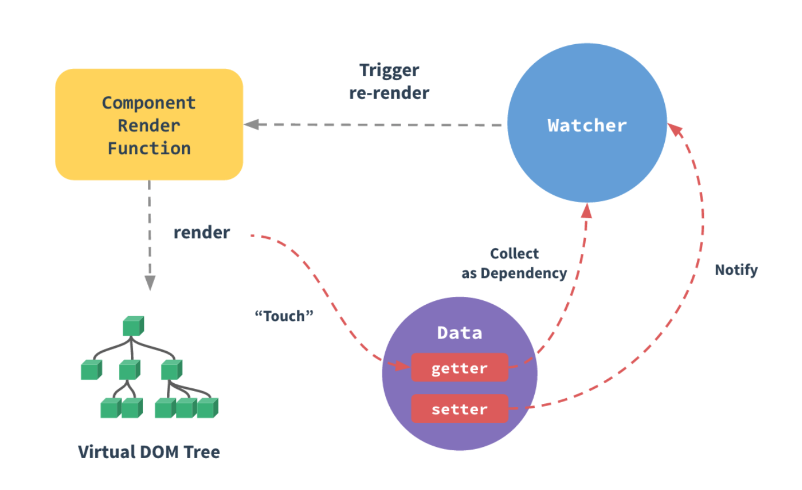

# Vue.js 알아보기

### Vue Reactivity
```js
    Object.defineProperty(대상 객체, '변경할 속성 이름', {
        get: function() {},
        set: function(newValue) {}
    })
```


> 출처: https://vuejs.org/v2/guide/reactivity.html#ad

- 참고자료
    <https://joshua1988.github.io/vue-camp/>

### VuePress 설치
```js
    npm install -D vuepress
```
- <https://vuepress.vuejs.org/guide/getting-started.html#global-installation>

### 개발환경 세팅
- 플러그인 설치
    - Chrome
    - Node.js
    - VSCode
    - vue.js
    - Devtools 
    - Auto Close Tag
    - Color Picker
    - GitLens
    - Material Icon Theme
    - Night Owl
    - Material Syntax - Dark
    - Flat Ui(밝은색 코드 컬러)
    - Project Manager
    - Vetur
    - ESLint
    - TSLint
    - Open in browser
    - Live Server
