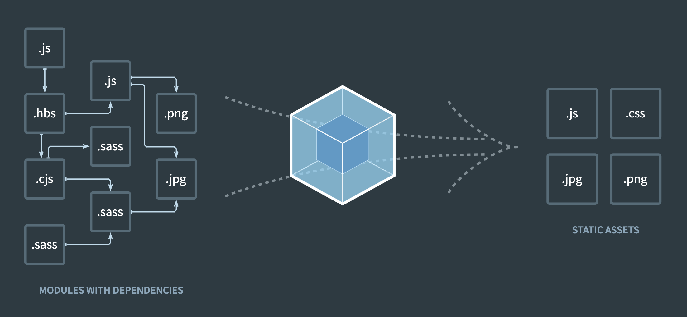

# webpack

- 프로젝트의 구조를 분석하고 자바스크립트 모듈 등의 관련 리소스들을 브라우저에서 이용할 수 있는 번들로 묶고 패킹하는 모듈 번들러(Module bundler)이다.
- node, vue cli 설치되어 있어야 하며 npm으로 설치



### 웹팩 튜토리얼 절차

1. npm init -y
2. npm i webpack webpack-cli -D
3. index.html 생성 후 내용 복사
4. src/index.js 생성 후 내용 복사
5. lodash 라이브러리 설치

```js
npm i lodash
```

6. 웹팩 명령어 실행

```js
webpack --mode=none
```
