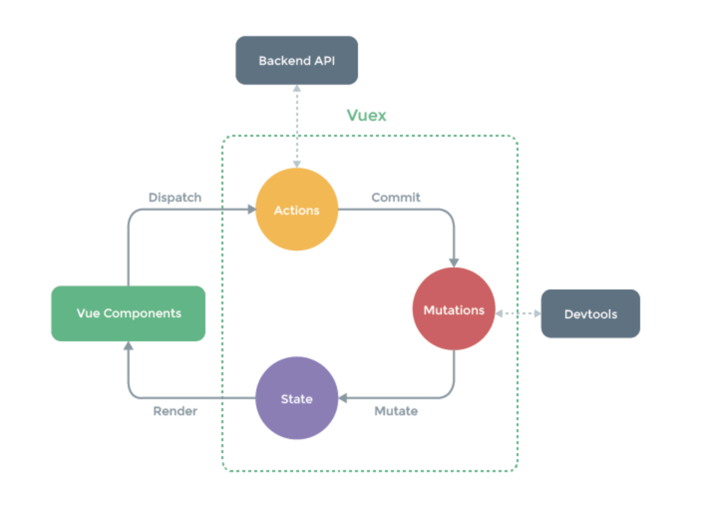

# vuex

- Vue.js 의 상태관리 를 위한 패턴이자 라이브러리. 다른 상태관리 패턴이나 라이브러리와 비교했을 때 Vue 의 Reactivity 체계를 효율적으로 활용하여 화면 업데이트가 가능하다는 차이점이 있다.

### vuex를 쓰는 이유

- 컴포넌트 기반 프레임워크에서는 화면 구성을 위해 화면 단위를 매우 잘게 쪼개서 컴포넌트로 사용한다. 예를 들면, header, button, list 등의 작은 단위들이 컴포넌트가 되어 한 화면에서 많은 컴포넌트를 사용하게 된다. 이에 따라 컴포넌트 간의 통신이나 데이터 전달을 좀 더 유기적으로 관리할 필요성이 생긴다.
- 달리 말해, header -> button, button -> list , button -> footer 등의 컴포넌트 간 데이터 전달 및 이벤트 통신 등의 여러 컴포넌트의 관계를 한 곳에서 관리하기 쉽게 구조화 하는 것이 State Management다.
- Vue 와 성격이 유사한 프론트엔드 프레임워크인 React 에서는 이미 Redux, Flux 와 같은 상태 라이브러리를 사용하고 있고, Vue 도 Vuex 라는 상태관리 라이브러리를 사용한다.

### 설치

```js
npm i vuex
```

### vuex

- store -> index.js
- state (component의 data 속성)
- mutations (component의 methods 함수)

### 상태관리로 해결할 수 있는 문제점

상태관리는 중대형 규모의 앱 컴포넌트들을 더 효율적으로 관리하기 위한 기법이다. 일반적으로 앱의 규모가 커지면서 생기는 문제점들은 아래와 같다.

- Vue 의 기본 컴포넌트 통신방식인 상위 - 하위 에서 중간에 거쳐야 할 컴포넌트가 많아지거나
- 이를 피하기 위해 Event Bus 를 활용하여 상하위 관계가 아닌 컴포넌트 간 통신 시 관리가 되지 않는 점
  <br>이러한 문제점들을 해결하기 위해 모든 데이터 통신 (state) 을 한 곳에서 중앙 집중식으로 관리한다.


