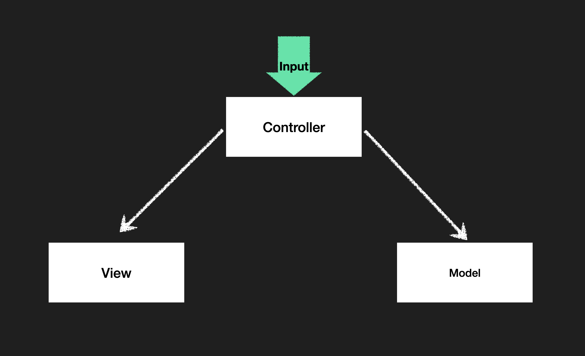
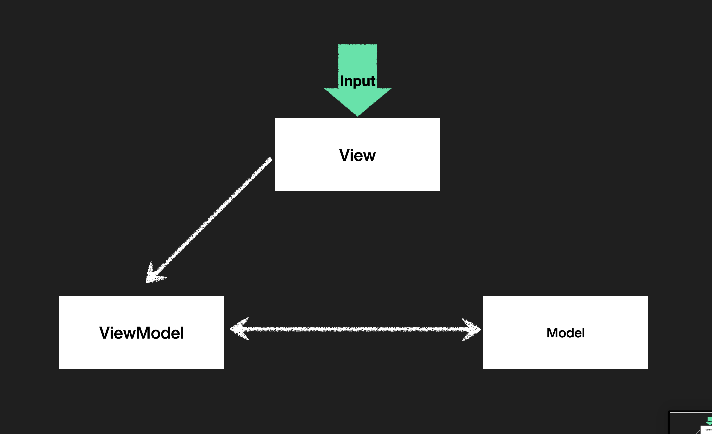

# MVC / MVVM 아키텍쳐

### MVC 패턴이란

Controller가 View를 여러개 선택 가능
-> Controller 복잡도가 높아진다.
Model db에 직접 접근X. api를 통해서 데이터를 가져와서 전달 데이터를 관리
View Model의 데이터를 화면에 그리는 역할. 입력된 값을 다른 객체에게 전달
모델과 뷰는 직접적 연결X. 컨트롤러로 연결

### MVVM 패턴이란

View가 중심이 되는 패턴
-> View.js가 ViewModel의 역할을 한다.
